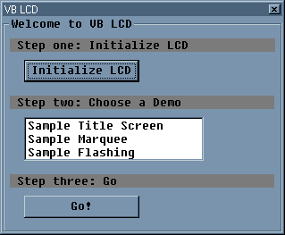



## HD44780 LCD Controller UPDATE

### Description

This code allows the controlling of a HD44780 LCD Module connected to your parallel port. Now supports Custom Characters!
 
### More Info
 
Parallel port address of 378. Although it can be changed in code.

If you do not have a HD44780 LCD module, dont bother downloading.

             |
---                |---
**Submitted On**   |1999-01-10 03:20:10
**By**             |[Eddy Richard](https://github.com/Planet-Source-Code/PSCIndex/blob/master/ByAuthor/eddy-richard.md)
**Level**          |Advanced
**User Rating**    |5.0 (15 globes from 3 users)
**Compatibility**  |VB 4\.0 \(32\-bit\), VB 5\.0, VB 6\.0
**Category**       |[Miscellaneous](https://github.com/Planet-Source-Code/PSCIndex/blob/master/ByCategory/miscellaneous__1-1.md)
**World**          |[Visual Basic](https://github.com/Planet-Source-Code/PSCIndex/blob/master/ByWorld/visual-basic.md)
**Archive File**   |[HD44780\_LC657723272002\.zip](https://github.com/Planet-Source-Code/eddy-richard-hd44780-lcd-controller-update__1-32892/archive/master.zip)

